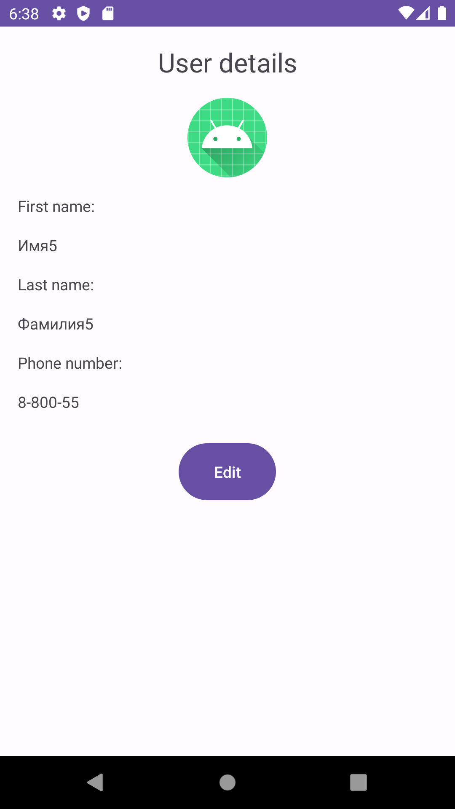

# users_fragments
This repository for training fragment

This app displays a list of users with images and text. When we click on a user, we can see all the information about the user, including their photo, name, last name, and phone number. We can also edit the user's information.

## Built With
1. Kotlin
2. XML
3. RecyclerView
4. Fragment manager
5. Result API

## Gif

## Screenshots
 
 
